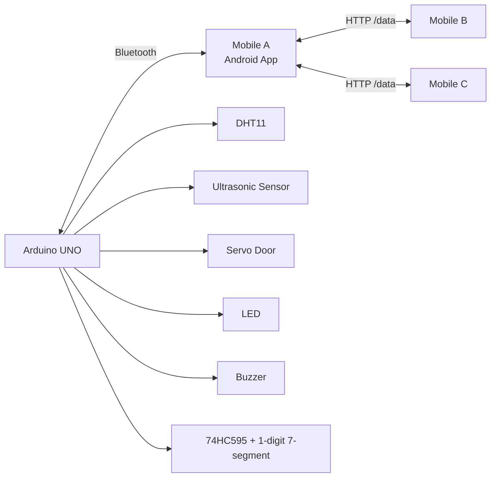
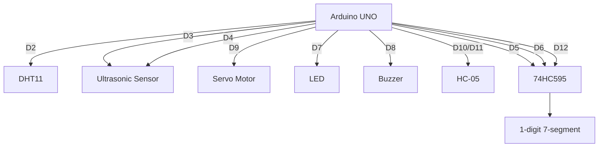

# AdHoc Smart Access System

Android + Arduino project for a local AdHoc-style monitoring and control system.

The project uses:
- An Android app built with Kotlin and Jetpack Compose
- An Arduino with sensors and actuators connected over Bluetooth Classic
- A local HTTP server on Mobile A to share live data with other mobile clients over WiFi
- A 1-digit 7-segment display driven by a 74HC595 to show connected device count

## Overview

Mobile A connects to the Arduino through Bluetooth and acts as the gateway device.
It receives live sensor data, sends control commands, and optionally starts a local HTTP server.
Other devices (Mobile B / Mobile C) connect to Mobile A over WiFi and read the shared JSON data.

Main features:
- Bluetooth connection to HC-05 / serial-compatible module
- Real-time sensor dashboard
- Door control
- LED control
- Buzzer control
- WiFi sharing through local HTTP server
- Connected-device count shown on a 7-segment display
- Control-state sync in JSON (`door`, `led`, `buzzer`)

## Architecture



## Repository Structure

```text
AppMovil - AdHoc/
├── app/                    # Android application
├── Arduino_AdHoc/         # Arduino sketch
├── gradle/                # Gradle wrapper / version catalog
├── build.gradle.kts
└── settings.gradle.kts
```

Important Android files:
- `app/src/main/java/com/usj/adhoc/MainActivity.kt`
- `app/src/main/java/com/usj/adhoc/AppViewModel.kt`
- `app/src/main/java/com/usj/adhoc/bluetooth/BluetoothManager.kt`
- `app/src/main/java/com/usj/adhoc/server/AdHocHttpServer.kt`
- `app/src/main/java/com/usj/adhoc/screens/`

Important Arduino file:
- `Arduino_AdHoc/Arduino_AdHoc.ino`

## Android App

### Tech Stack

- Kotlin 2.0.21
- Jetpack Compose
- Material 3
- Navigation Compose 2.7.7
- NanoHTTPD 2.3.1
- Min SDK 29
- Target SDK 36

### Screens

1. `ConnectionScreen`
   - Connect to the Bluetooth device
   - Or enter directly as WiFi client

2. `DashboardScreen`
   - Temperature
   - Humidity
   - Distance
   - Door status
   - LED status
   - Buzzer status

3. `ControlScreen`
   - LED ON / OFF
   - Door OPEN / CLOSE
   - Buzzer ON / OFF

4. `WifiAdHocScreen`
   - Start / stop local HTTP server on Mobile A
   - Connect as HTTP client on Mobile B / C
   - Show shared control and sensor data

## Arduino Hardware

### Components

- Arduino UNO or compatible board
- HC-05 Bluetooth module
- DHT11 temperature / humidity sensor
- Ultrasonic sensor (HC-SR04 style)
- Servo motor
- LED
- Buzzer
- 74HC595 shift register
- 1-digit 7-segment display
- Resistors / jumper wires / power rails as needed

### Pin Mapping

| Module | Arduino Pin(s) |
|---|---|
| DHT11 data | D2 |
| Ultrasonic TRIG | D3 |
| Ultrasonic ECHO | D4 |
| 74HC595 DATA | D5 |
| 74HC595 CLOCK | D6 |
| LED | D7 |
| Buzzer | D8 |
| Servo signal | D9 |
| HC-05 TX/RX via SoftwareSerial | D10 / D11 |
| 74HC595 LATCH | D12 |

### Arduino Circuit Diagram



### Wiring Notes

- `HC-05` uses `SoftwareSerial bt(10, 11)` in the sketch.
  - Arduino receives on pin `10`
  - Arduino transmits on pin `11`
- The servo is attached to pin `9`
- The 7-segment display is updated through the `74HC595` using:
  - `DATA_PIN = 5`
  - `CLOCK_PIN = 6`
  - `LATCH_PIN = 12`
- The display shows total connected devices:
  - `1` for Mobile A when Bluetooth is connected
  - `+ WiFi clients` connected to the local HTTP server

## Data Flow

### Bluetooth Telemetry From Arduino

Current line format sent from Arduino:

```text
temp,hum,dist,door,led,buzzer
```

Example:

```text
24.00,60.00,15.20,OPEN,ON,OFF
```

Fields:
- `temp`: temperature in Celsius
- `hum`: humidity percentage
- `dist`: measured distance in cm
- `door`: `OPEN` or `CLOSED`
- `led`: `ON` or `OFF`
- `buzzer`: `ON` or `OFF`

### Commands Sent From Android To Arduino

Supported commands:

```text
LED_ON
LED_OFF
BUZZER_ON
BUZZER_OFF
DOOR_OPEN
DOOR_CLOSE
CLIENTS:N
```

`CLIENTS:N` is used to update the 7-segment display with the number of connected devices.

### HTTP JSON Shared By Mobile A

Endpoint:

```text
GET /data
```

Example response:

```json
{
  "temp": 24.0,
  "hum": 60.0,
  "dist": 15.2,
  "door": "OPEN",
  "control": {
    "door": "OPEN",
    "led": true,
    "buzzer": false
  }
}
```

Notes:
- `door` is kept at top level for compatibility
- `control` contains the full actuator state shared with WiFi clients
- WiFi clients send a unique `id` query parameter so Mobile A can count distinct devices correctly

## Device Roles

### Mobile A

- Connects to Arduino over Bluetooth
- Receives sensor data
- Sends actuator commands
- Starts local HTTP server
- Shares JSON with WiFi clients
- Updates Arduino display with connected-device count

### Mobile B / Mobile C

- Connect to Mobile A over WiFi
- Read `/data`
- Display live sensor and control state
- Identified uniquely using a generated client ID

## Connected Device Count Logic

The 7-segment display is managed from the Android side using `CLIENTS:N` messages.

Behavior:
- Bluetooth connected to Mobile A => count starts at `1`
- Each active WiFi client increases the total count
- If Bluetooth stops sending updates, Arduino watchdog resets the display to `0`

Arduino watchdog settings from the sketch:
- `BT_TIMEOUT = 8000`

## Build And Run

### Android App

1. Open `AppMovil - AdHoc` in Android Studio
2. Sync Gradle
3. Connect a phone or launch an emulator
4. Run the app

### Arduino

1. Open `Arduino_AdHoc/Arduino_AdHoc.ino` in Arduino IDE
2. Install required libraries:
   - `DHT sensor library`
   - `Servo` (usually built in)
   - `SoftwareSerial` (built in)
3. Select the correct board and COM port
4. Upload the sketch

## How To Test

### Bluetooth + Local Gateway

1. Power the Arduino and HC-05
2. Pair the phone with the HC-05 in Android Bluetooth settings
3. Open the app on Mobile A
4. Connect from `ConnectionScreen`
5. Open Dashboard / Control to verify telemetry and commands

### WiFi AdHoc / Local HTTP Sharing

1. Connect Mobile B / C to the same WiFi / hotspot as Mobile A
2. On Mobile A, go to `WiFi AdHoc`
3. Start the server
4. On Mobile B / C, enter Mobile A IP address
5. Request data or enable auto-refresh

## Permissions

The app requests / uses:
- Bluetooth legacy permissions for API 30 and below
- `BLUETOOTH_SCAN`, `BLUETOOTH_CONNECT`, `BLUETOOTH_ADVERTISE` for modern Android
- Fine / coarse location for Bluetooth behavior
- Internet / WiFi state permissions for local HTTP sharing

## Known Notes

- The local HTTP server survives screen navigation and stays active until `Detener Servidor` is pressed
- Two emulators on the same host are counted separately using a unique client ID in the request URL